---

## Entity-Relationship Diagram (ERD)

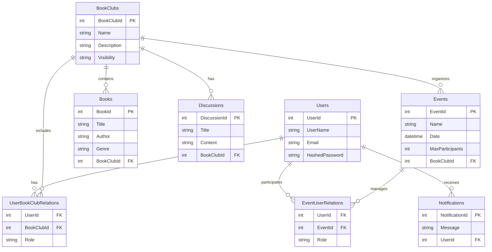

---

## Default Route - Static File Service

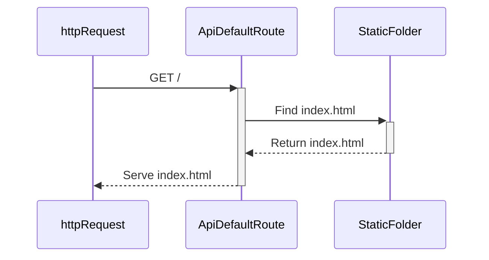

**Description:**
- **GET Request:** The user sends a `GET` request to the `/` route.
- **Static File:** The API retrieves the `index.html` file from the static folder and serves it to the browser.

---

## Register User

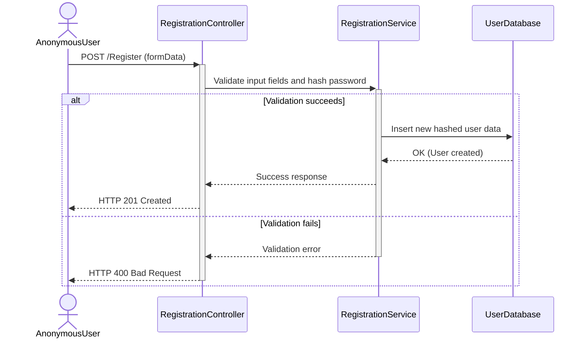

**Description:**
- **User Input:** The user fills in the registration form and submits it.
- **Validation:** The `RegistrationController` checks for completeness and validity of data, including password hashing.
- **Success:** If valid, user data is stored in the database, and an HTTP 201 response is returned.
- **Failure:** If invalid, an HTTP 400 response is returned with an error message.

---

## Homepage with Token Validation

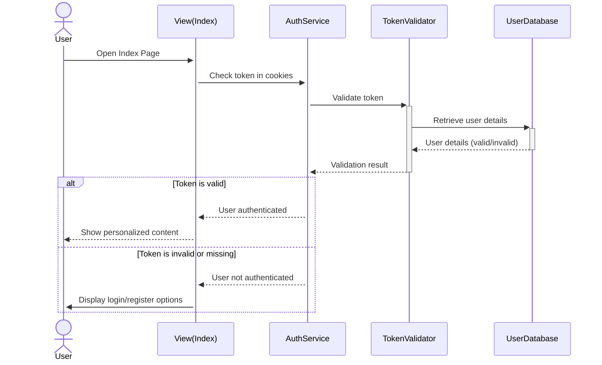

**Description:**
- **Page Load:** The user opens the homepage, and the system checks for an authentication token.
- **Token Validation:** If a valid token exists, personalized content is displayed.
- **Fallback:** If the token is invalid or missing, login/registration options are shown.

---

## User Login

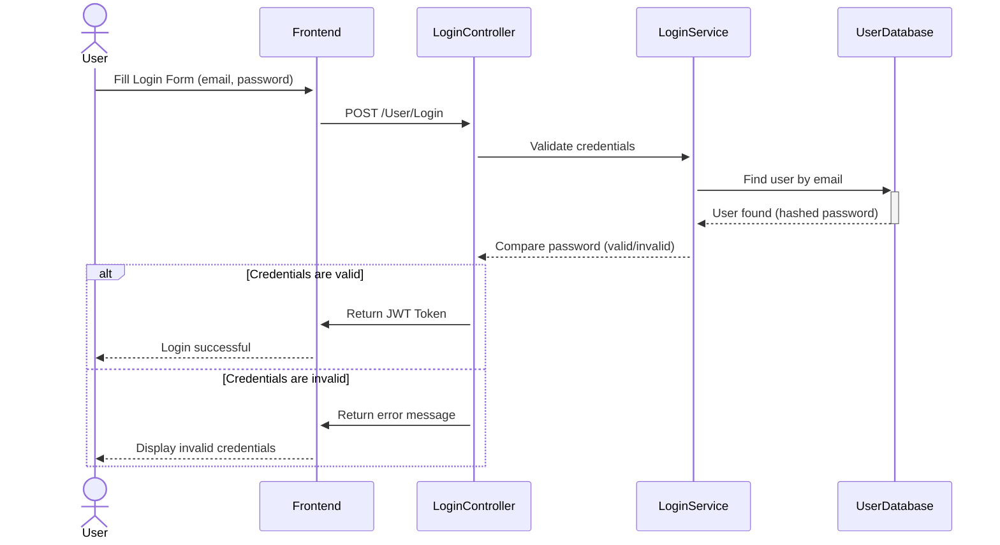

**Description:**
- **Login Request:** The user submits their email and password through the login form.
- **Validation:** The `LoginController` validates the credentials against the database.
- **Success:** If valid, a JWT token is generated, granting access.
- **Failure:** An error message is returned if the credentials are invalid.

---

## Create Book Club

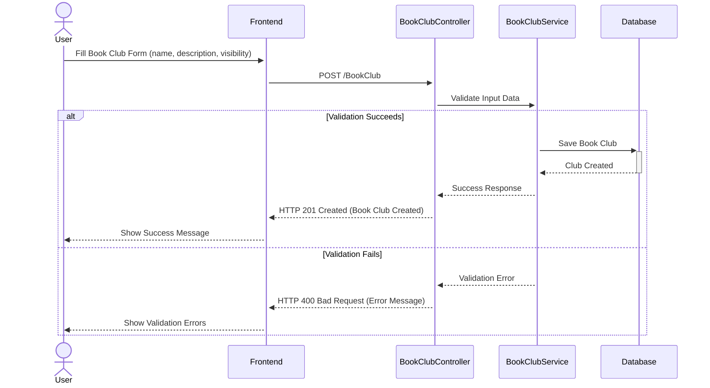

**Description**
- **Form Submission:**
  - The user fills out a form with the book club's name, description, and visibility (public or private).
- **Validation:**
  - The `BookClubController` receives the form data and forwards it to the `BookClubService` for validation.
  - All required fields are checked for presence and correctness.
- **Successful Scenario:**
  - If validation succeeds:
    - The book club information is saved to the database.
    - The user receives a success message (HTTP 201 Created) confirming the club creation.
- **Failed Scenario:**
  - If validation fails:
    - An error message is returned (HTTP 400 Bad Request) indicating the issues.
    - The user is prompted to correct the errors.

---

## Start Discussion

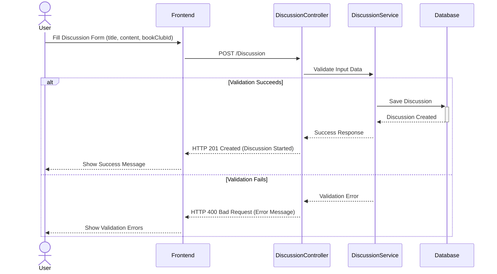

**Description**
- **Form Submission:**
  - The user submits a form with the discussion title, content, and the associated book club ID.
- **Validation:**
  - The `DiscussionController` forwards the form data to the `DiscussionService` for validation.
  - Checks include ensuring all required fields (title, content, bookClubId) are complete.
- **Successful Scenario:**
  - If validation succeeds:
    - The discussion is saved to the database.
    - A success message is returned (HTTP 201 Created) confirming the discussion has been started.
- **Failed Scenario:**
  - If validation fails:
    - An error message is returned (HTTP 400 Bad Request) indicating missing or incorrect information.
    - The user is shown validation errors and asked to make corrections.

---

## RSVP to Event

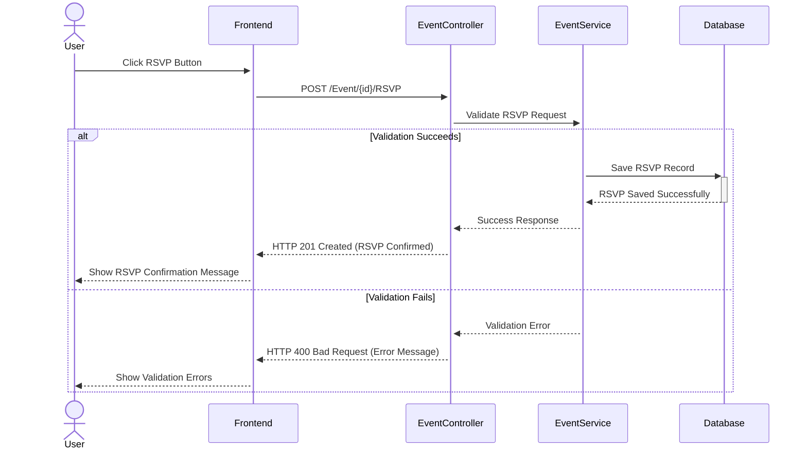

**Description**
- **User Action:**
  - The user clicks the RSVP button for an event.
- **Request Handling:**
  - The `EventController` processes the RSVP request and forwards it to the `EventService` for validation.
- **Successful Scenario:**
  - If validation succeeds:
    - The RSVP record is saved to the database.
    - A success message (HTTP 201 Created) confirms the RSVP.
    - The user sees a confirmation message on the frontend.
- **Failed Scenario:**
  - If validation fails:
    - An error message (HTTP 400 Bad Request) is returned, detailing the issues.
    - The user is prompted to correct the errors and try again.

---

## Send Notification

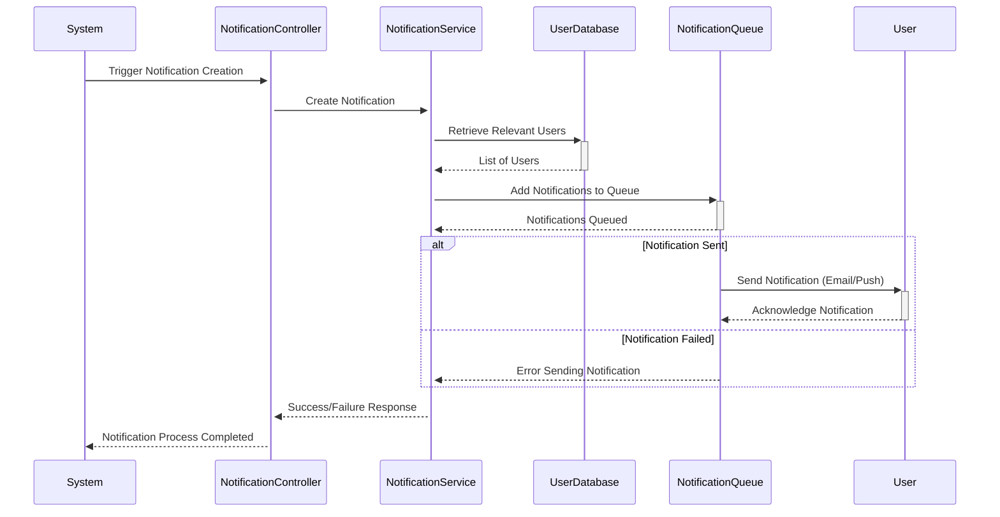

**Description**  
- **Notification Creation:**
  - The system initiates a notification for a specific event (e.g., a new event creation or a discussion start).
- **Identifying Recipients:**
  - The `NotificationService` queries the database to identify the users who should receive the notification.
- **Queuing Notifications:**
  - Notifications are added to a background queue for processing.
- **Sending Notifications:**
  - **Successful Scenario:** Notifications are sent to users via email or push notifications.
  - **Failed Scenario:** If an error occurs during delivery, it is logged, and error-handling is triggered.
- **Outcome:**
  - The system records whether notifications were successfully delivered or failed, supporting auditing and retry mechanisms.

---

## Adding a Book

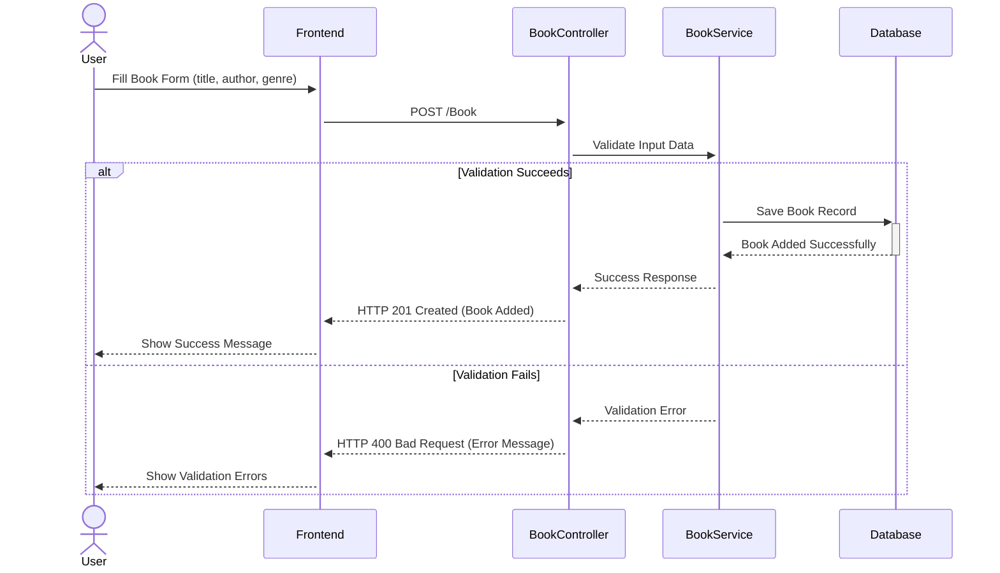

**Description**
- **Adding a Book:**
  - The user fills out a form with book details (e.g., title, author, genre) and submits it.
- **Validation:**
  - The `BookController` forwards the data to `BookService` for validation.
- **Successful Scenario:**
  - Valid data is saved in the database.
  - The user receives a success message (HTTP 201 Created).
- **Failed Scenario:**
  - If there are errors (e.g., missing fields), an error message (HTTP 400 Bad Request) is returned.
  - The user is prompted to correct their input.

---

## Delete Book

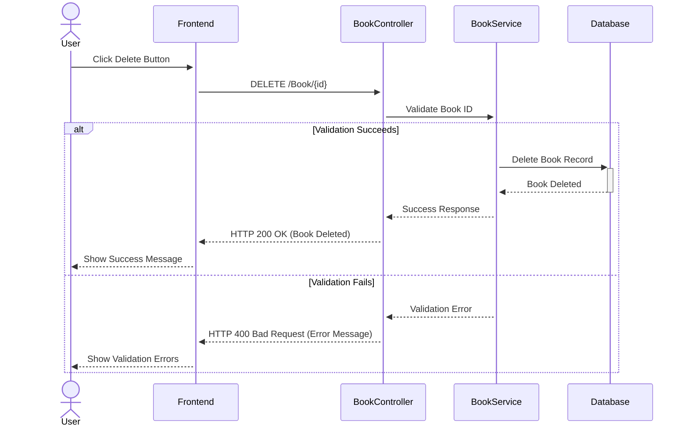

**Description**
- **User Action:**
  - The user clicks the delete button for a specific book.
- **Process:**
  - The `BookController` handles the `DELETE` request and forwards it to the `BookService`.
  - The `BookService` validates the book ID and processes the deletion.
- **Successful Scenario:**
  - The book is deleted from the database.
  - The user receives a success message (HTTP 200 OK).
- **Failed Scenario:**
  - If the book does not exist or an error occurs, an error message (e.g., HTTP 404 Not Found or HTTP 400 Bad Request) is returned.

---

## Edit Book

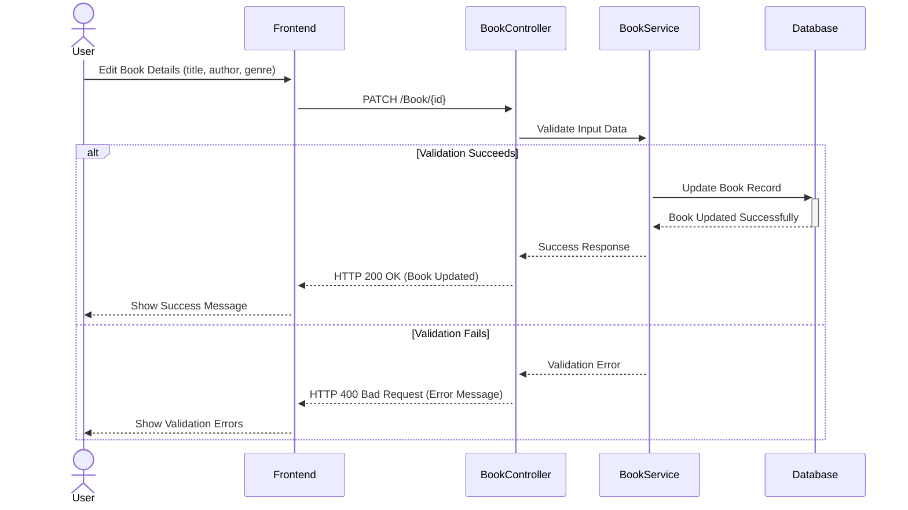

**Description**
- **User Action:**
  - The user edits book details (e.g., title, author, genre) via a form and submits it.
- **Process:**
  - The `BookController` processes the `PATCH` request and sends it to `BookService`.
  - The `BookService` validates the input data and updates the record in the database.
- **Successful Scenario:**
  - The book record is updated, and the user receives a success message (HTTP 200 OK).
- **Failed Scenario:**
  - If validation fails or the book does not exist, an error message (HTTP 400 Bad Request) is returned.
  - The user is prompted to correct their input.

---

## Search & Filter

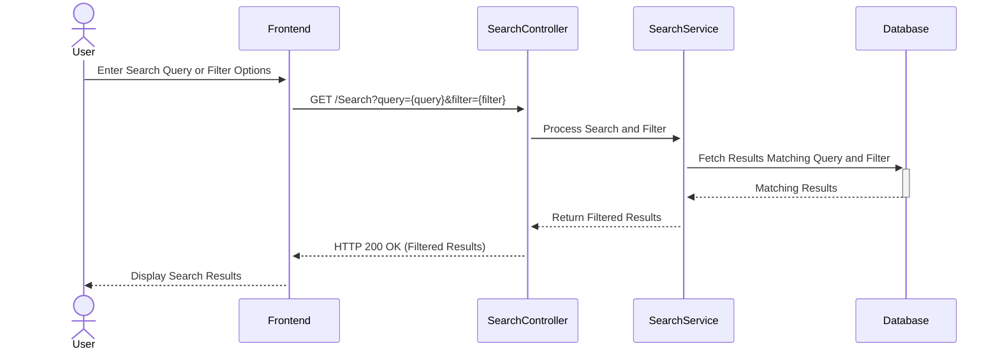

**Description**  
- **Search and Filtering:**
  - The user enters a query (e.g., book title, author) or selects filtering options (e.g., genre, date) in the search bar.
- **API Request:**
  - The frontend sends a `GET` request to the API with the query and filter parameters.
- **Processing Results:**
  - The API processes the request by querying the database for matching results.
  - The results are filtered based on the query and returned to the frontend.
- **Displaying Results:**
  - The frontend displays the search results to the user.

---

## BookSphere System Architecture Diagram

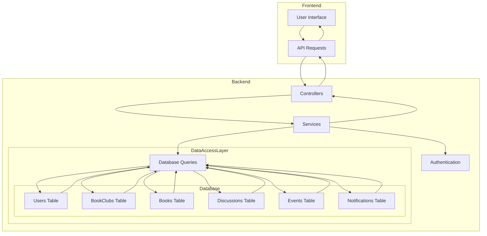

**Description**  
1. **Frontend:**
   - **HTML/CSS/JavaScript:** Responsible for rendering the user interface.
   - **API Requests:** Handles communication with the backend for data retrieval and updates.
   - **Responsive Design:** Ensures the application is accessible on desktop and mobile devices.
2. **Backend:**
   - **ASP.NET Core Web API:** Manages the business logic and serves as the main API layer.
   - **Controllers:** Processes incoming requests and routes them to appropriate services.
   - **Services:** Contains the core business logic, including validations and computations.
   - **Authentication:** Manages secure user sessions using JWT (JSON Web Tokens).
3. **Database:**
   - **SQLite:** Serves as the primary data store.
   - **Tables:** Includes Users, BookClubs, Books, Events, Discussions, and Notifications for structured data storage and retrieval.

---

## User Roles and Authorization Diagram

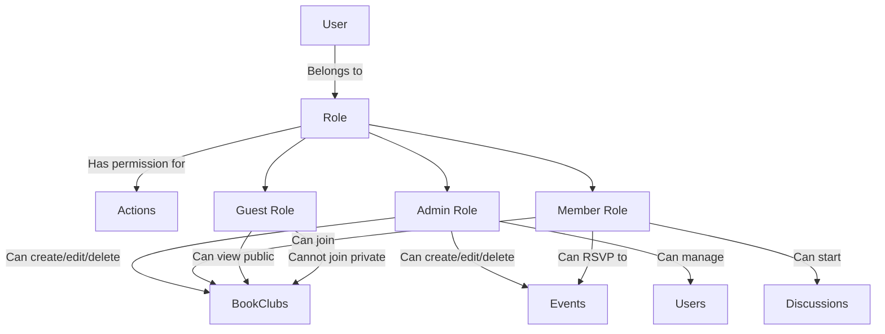

**Description**  
- **Roles and Permissions:**
  - **Admin:** Has full access, including creating, editing, deleting book clubs and events, and managing users.
  - **Member:** Can join book clubs, RSVP to events, and start discussions.
  - **Guest:** Can view public book clubs but cannot join private ones.

---

## Notification Workflow

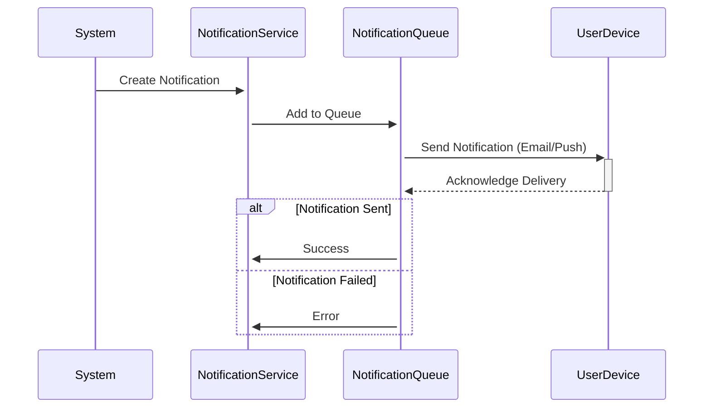

**Description**  
- **Notification Creation:**  
  - Notifications are triggered by specific events like new discussions or event updates.
- **Queuing and Delivery:**  
  - Notifications are queued and sent to users via email or push notifications.
- **Status Logging:**  
  - Success or failure is logged for auditing and retry purposes.

---

## Performance and Logging Diagram

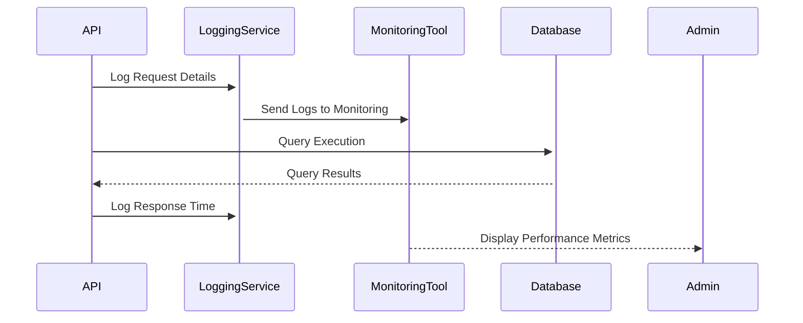

**Description**  
- **Request Logging:**  
  - Each API request and its details are logged.
- **Performance Monitoring:**  
  - Logs are sent to monitoring tools for performance analysis and debugging.

---

## Admin Panel Workflow

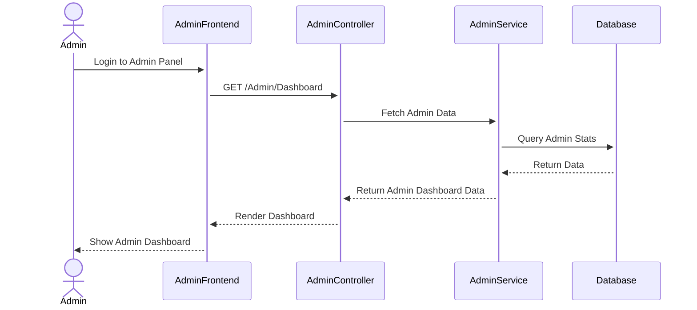

**Description**  
- **Admin Actions:**  
  - The admin accesses the dashboard to view statistics and manage the platform.
- **Data Retrieval:**  
  - Relevant data is fetched from the database and displayed on the admin dashboard.

---

## API Call Flow

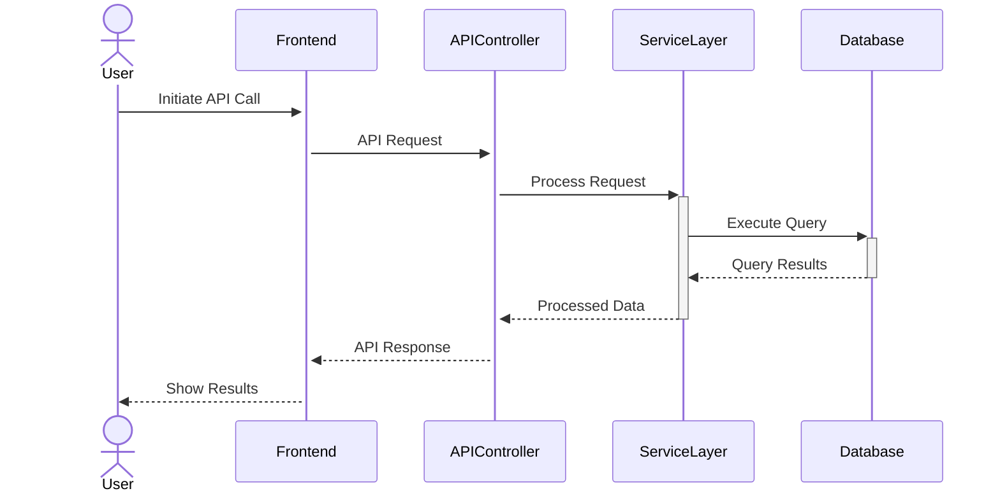

**Description**  
- **Request Handling:**  
  - The frontend sends API requests to the backend, which processes them in the service layer.
- **Database Interaction:**  
  - The service layer interacts with the database for data retrieval or updates.
- **Response Delivery:**  
  - Processed results are returned to the frontend, which displays them to the user.

---

   
