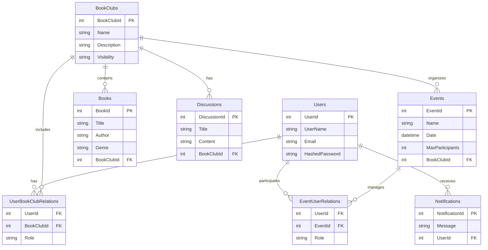
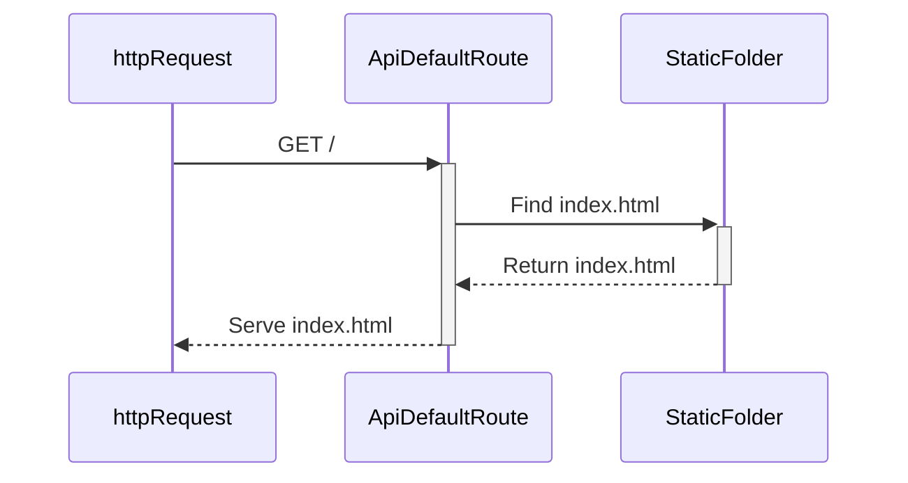
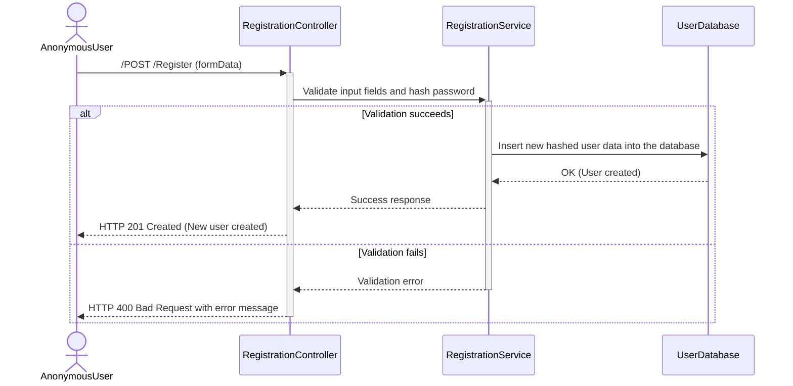
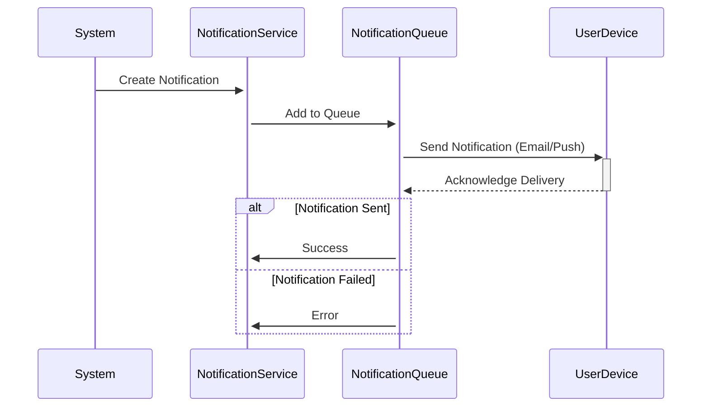
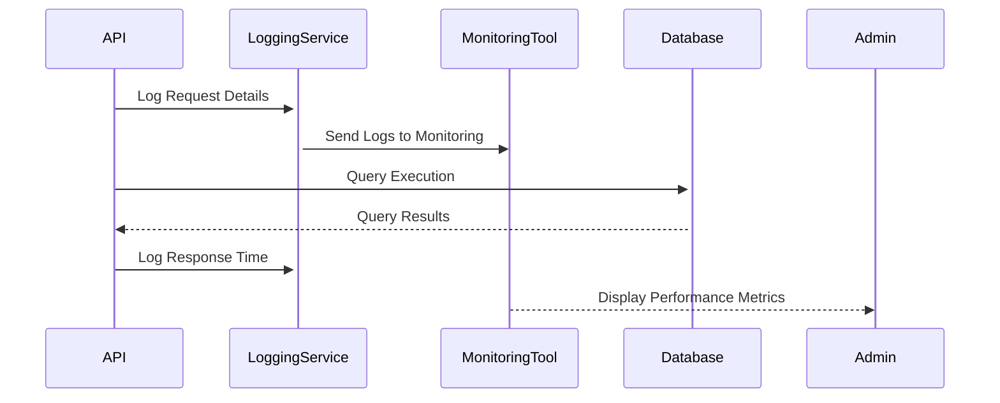
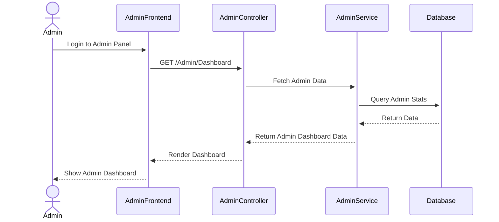
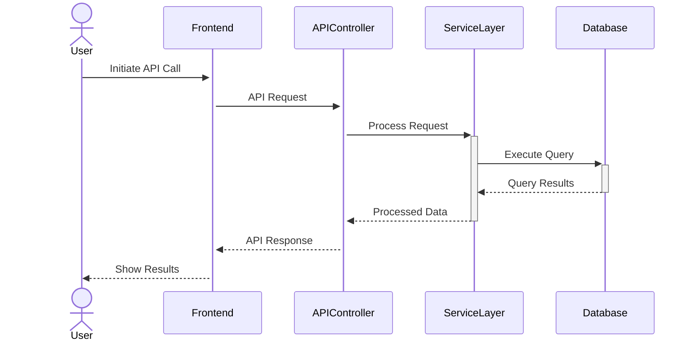

## Entitetsrelasjonsdiagram



## Default Route - Static File Servisi


 **Description:**

- The user sends a GET request to the / route from their browser.
- The API searches for the index.html file in the StaticFolder and, if found, returns it to the browser.

## Register User

 **Description:**

- The user fills out the registration form and submits it.
- The RegistrationController receives the form data and validates it through the RegistrationService.
- If Validation Succeeds:
- User information (with the hashed password) is saved to the UserDatabase.
- Upon successful registration, the user receives a success message (HTTP 201 Created).
- If Validation Fails:
- A validation error is returned for missing or invalid fields (HTTP 400 Bad Request).


## Homepage with Token Validation

```mermaid
sequenceDiagram
    actor User
    participant View(Index)
    participant AuthService
    participant TokenValidator
    participant UserDatabase

    User ->>+ View(Index): "Open Index Page"
    View(Index) ->>+ AuthService: "Check token in cookies"
    AuthService ->>+ TokenValidator: "Validate token"
    TokenValidator ->>+ UserDatabase: "Retrieve user details"
    UserDatabase -->>- TokenValidator: "User details (if token is valid)"
    TokenValidator -->>- AuthService: "Validation result (valid/invalid)"
    alt Token is valid
        AuthService -->> View(Index): "User authenticated"
        View(Index) -->> User: "Show personalized content"
    else Token is invalid or missing
        AuthService -->> View(Index): "User not authenticated"
        View(Index) ->>+ User: "Display login/register options"
    end

 ```

  **Description**

- User Opens the Page:
- The user opens the homepage (Index) in their browser.
- Token Check:
- The AuthService checks if there is a token in the user's browser cookies.
- If a token exists, it is validated through the TokenValidator.
- Token Validation:
- The TokenValidator queries the database to check if the token is valid.
- If the token is valid, user information is returned.
- Outcome and View:
- If the token is valid:
- The user is shown a personalized homepage (e.g., their username and private book clubs).
- If the token is invalid or missing:
- The user is presented with login or registration options.

  ## User Login

   ```mermaid
      sequenceDiagram
        actor User
        participant Frontend
       participant LoginController
       participant LoginService
    participant UserDatabase

    User ->>+ Frontend: Fill Login Form (email, password)
    Frontend ->>+ LoginController: POST /User/Login
    LoginController ->>+ LoginService: Validate Credentials
    LoginService ->>+ UserDatabase: Find User by Email
    UserDatabase -->>- LoginService: User Found (hashed password)
    LoginService -->> LoginController: Compare Password (valid/invalid)
    alt Credentials are valid
        LoginController ->> Frontend: Return JWT Token
        Frontend -->> User: Login Successful
    else Credentials are invalid
        LoginController ->> Frontend: Return Error Message
        Frontend -->> User: Display Invalid Credentials
    end

    ```
    **Description**
   - Form Submission:
   - The user fills in their email and password in the login form and submits it (POST /User/Login).

   - Authentication Process:
   - LoginController:
   - Receives the email and password from the user.

   - LoginService:
   - Searches the database for a user with the provided email.
   - Validates the password by comparing it with the hashed password stored in the database.

   - Successful Login:
   - If the password is correct:
   - The API generates a JWT (JSON Web Token) for the user.
   - The user can now access the platform with authenticated privileges.

   - Failed Login:
   - If the email is not found or the password is incorrect:
   - An error message is returned.
   - The user is informed that their login credentials are invalid.


   ## Create Book Club
    ```mermaid
   sequenceDiagram
    actor User
    participant Frontend
    participant BookClubController
    participant BookClubService
    participant Database

    User ->>+ Frontend: Fill Book Club Form (name, description, visibility)
    Frontend ->>+ BookClubController: POST /BookClub
    BookClubController ->>+ BookClubService: Validate Input Data
    alt Validation Succeeds
        BookClubService ->>+ Database: Save Book Club
        Database -->>- BookClubService: Club Created
        BookClubService -->> BookClubController: Success Response
        BookClubController -->> Frontend: HTTP 201 Created (Book Club Created)
        Frontend -->> User: Show Success Message
    else Validation Fails
        BookClubService -->> BookClubController: Validation Error
        BookClubController -->> Frontend: HTTP 400 Bad Request (Error Message)
        Frontend -->> User: Show Validation Errors
    end

     ```
     **Description**
- Form Submission:
- The user fills out a form with the book club's name, description, and whether it will be public or   private.

- Validation:
- BookClubController:
- Receives the form data and forwards it to the BookClubService.
- BookClubService:
- Checks if all required fields are present and ensures the data is in the correct format.
- Successful Scenario:
- If validation succeeds:
- The book club information is saved to the database.
- A success message is returned to the user, along with confirmation that the club was created (HTTP 201 Created).
- Failed Scenario:
- If validation fails:
- An error message is returned, indicating missing or invalid information (HTTP 400 Bad Request).
- The user is shown validation errors to correct their input.


## Start Discussion

     ```mermaid
     sequenceDiagram
    actor User
    participant Frontend
    participant DiscussionController
    participant DiscussionService
    participant Database

    User ->>+ Frontend: Fill Discussion Form (title, content, bookClubId)
    Frontend ->>+ DiscussionController: POST /Discussion
    DiscussionController ->>+ DiscussionService: Validate Input Data
    alt Validation Succeeds
        DiscussionService ->>+ Database: Save Discussion
        Database -->>- DiscussionService: Discussion Created
        DiscussionService -->> DiscussionController: Success Response
        DiscussionController -->> Frontend: HTTP 201 Created (Discussion Started)
        Frontend -->> User: Show Success Message
    else Validation Fails
        DiscussionService -->> DiscussionController: Validation Error
        DiscussionController -->> Frontend: HTTP 400 Bad Request (Error Message)
        Frontend -->> User: Show Validation Errors
    end


     ```
**Description**
- Form Submission:
- The user fills out the discussion form, providing the discussion title, content, and the associated book club (bookClubId).
- Validation:
- DiscussionController:
- Receives the form data and forwards it to the DiscussionService for validation.
- Validation Process:
- Mandatory fields (title, content, book club ID) are checked for completeness and correctness.
- Successful Scenario:
- If validation succeeds:
- The discussion details are saved to the database.
- A success message is returned to the user, confirming that the discussion has been started (HTTP 201 Created).
- Failed Scenario:
- If validation fails:
- An error message is returned, indicating invalid or missing information (HTTP 400 Bad Request).
- The user is presented with validation errors to correct their input.


## RSVP to Event
      ```mermaid
     sequenceDiagram
    actor User
    participant Frontend
    participant EventController
    participant EventService
    participant Database

    User ->>+ Frontend: Click RSVP Button
    Frontend ->>+ EventController: POST /Event/{id}/RSVP
    EventController ->>+ EventService: Validate RSVP Request
    alt Validation Succeeds
        EventService ->>+ Database: Save RSVP Record
        Database -->>- EventService: RSVP Saved Successfully
        EventService -->> EventController: Success Response
        EventController -->> Frontend: HTTP 201 Created (RSVP Confirmed)
        Frontend -->> User: Show RSVP Confirmation Message
    else Validation Fails
        EventService -->> EventController: Validation Error
        EventController -->> Frontend: HTTP 400 Bad Request (Error Message)
        Frontend -->> User: Show Validation Errors
    end
     
      ```

 **Description**  

 - User Action:
- The user clicks the RSVP (Join) button for an event.
- Request Handling:
- EventController:
- Receives the user's RSVP request and forwards it to the EventService for validation.
- Successful Validation:
- If the validation is successful:
- The RSVP information (user ID and event ID) is saved to the database.
- A success message is returned to the user, confirming the RSVP was completed (HTTP 201 Created).
- Failed Validation:
- If the validation fails:
- An error message is returned, indicating missing or invalid information (HTTP 400 Bad Request).
- The user is presented with validation errors to correct their input.

## Send Notification

    ```mermaid
     sequenceDiagram
     participant System
     participant NotificationController
     participant NotificationService
     participant UserDatabase
     participant NotificationQueue
     participant User

     System ->>+ NotificationController: Trigger Notification Creation
     NotificationController ->>+ NotificationService: Create Notification
     NotificationService ->>+ UserDatabase: Retrieve Relevant Users
     UserDatabase -->>- NotificationService: List of Users
     NotificationService ->>+ NotificationQueue: Add Notifications to Queue
     NotificationQueue -->>- NotificationService: Notifications Queued
     alt Notification Sent
         NotificationQueue ->>+ User: Send Notification (Email/Push)
        User -->>- NotificationQueue: Acknowledge Notification
     else Notification Failed
         NotificationQueue -->> NotificationService: Error Sending Notification
     end
       NotificationService -->> NotificationController: Success/Failure Response
     NotificationController -->> System: Notification Process Completed

    ```
       

**Description**  
- Notification Creation:
- The system initiates a notification for a specific event (e.g., a new event creation or the start of a discussion).
- Identifying Recipients:
- The NotificationService queries the database to retrieve a list of users who should receive the notification.
- Queuing Notifications:
- Before sending, notifications are added to the NotificationQueue, a background processing system.
- Sending Notifications:
- Successful Scenario:
- Notifications are sent to users via email or push notifications.
- Failed Scenario:
- If an error occurs, it is logged, and necessary error-handling procedures are initiated.
- Outcome:
- The system records the status of notification delivery (successful or failed) for auditing and follow-up actions.
  
## Adding a Book:
     ```mermaid
     sequenceDiagram
    actor User
    participant Frontend
    participant BookController
    participant BookService
    participant Database

    User ->>+ Frontend: Fill Book Form (title, author, genre)
    Frontend ->>+ BookController: POST /Book
    BookController ->>+ BookService: Validate Input Data
    alt Validation Succeeds
        BookService ->>+ Database: Save Book Record
        Database -->>- BookService: Book Added Successfully
        BookService -->> BookController: Success Response
        BookController -->> Frontend: HTTP 201 Created (Book Added)
        Frontend -->> User: Show Success Message
    else Validation Fails
        BookService -->> BookController: Validation Error
        BookController -->> Frontend: HTTP 400 Bad Request (Error Message)
        Frontend -->> User: Show Validation Errors
    end

     ```
**Description**
- Adding a Book:
-    The user fills out a form with the book details (e.g., title, author, genre) to add it to a book club.
- Successful Scenario:
-    The book details are saved to the database.
-    A success message is displayed to the user, confirming the book was added successfully.
- Failed Scenario:
-   If there are missing or incorrect details, an error message is returned.
-   The user is notified of the issues and prompted to correct the form input.

## Delete Book

      ```mermaid
      sequenceDiagram
    actor User
    participant Frontend
    participant BookController
    participant BookService
    participant Database

    User ->>+ Frontend: Click Delete Button
    Frontend ->>+ BookController: DELETE /Book/{id}
    BookController ->>+ BookService: Validate Book ID
    alt Validation Succeeds
        BookService ->>+ Database: Delete Book Record
        Database -->>- BookService: Book Deleted
        BookService -->> BookController: Success Response
        BookController -->> Frontend: HTTP 200 OK (Book Deleted)
        Frontend -->> User: Show Success Message
    else Validation Fails
        BookService -->> BookController: Validation Error
        BookController -->> Frontend: HTTP 400 Bad Request (Error Message)
        Frontend -->> User: Show Validation Errors
    end

      ```

  **Description**:
- The user clicks the "Delete" button for a specific book.

**Process**:
1. **Request Handling**:
   - The frontend sends a `DELETE` request to the `/Book/{id}` endpoint with the book's ID.
2. **Successful Scenario**:
   - `BookService` validates whether the book exists in the database.
   - If it exists, the book is deleted from the database.
   - A success message is returned to the user (HTTP 200 OK).
3. **Failed Scenario**:
   - If the book does not exist or another error occurs, an error message is returned (e.g., HTTP 404 Not Found).

---


## Edit Book


      ```mermaid
      sequenceDiagram
    actor User
    participant Frontend
    participant BookController
    participant BookService
    participant Database

    User ->>+ Frontend: Edit Book Details (title, author, genre)
    Frontend ->>+ BookController: PATCH /Book/{id}
    BookController ->>+ BookService: Validate Input Data
    alt Validation Succeeds
        BookService ->>+ Database: Update Book Record
        Database -->>- BookService: Book Updated Successfully
        BookService -->> BookController: Success Response
        BookController -->> Frontend: HTTP 200 OK (Book Updated)
        Frontend -->> User: Show Success Message
    else Validation Fails
        BookService -->> BookController: Validation Error
        BookController -->> Frontend: HTTP 400 Bad Request (Error Message)
        Frontend -->> User: Show Validation Errors
    end


      ```


**Description**:
- The user fills out a form to edit a book's details.

**Process**:
1. **Request Handling**:
   - The frontend sends a `PATCH` request to the `/Book/{id}` endpoint with the updated book details.
2. **Successful Scenario**:
   - `BookService` validates the book's existence and updates the database with the new information.
   - A success message is returned to the user, indicating the update was completed (HTTP 200 OK).
3. **Failed Scenario**:
   - If required fields are missing, the book cannot be found, or another error occurs, an error message is returned (e.g., HTTP 400 Bad Request).


## Search & Filter

      ```mermaid
      sequenceDiagram
    actor User
    participant Frontend
    participant SearchController
    participant SearchService
    participant Database

    User ->>+ Frontend: Enter Search Query or Filter Options
    Frontend ->>+ SearchController: GET /Search?query={query}&filter={filter}
    SearchController ->>+ SearchService: Process Search and Filter
    SearchService ->>+ Database: Fetch Results Matching Query and Filter
    Database -->>- SearchService: Matching Results
    SearchService -->> SearchController: Return Filtered Results
    SearchController -->> Frontend: HTTP 200 OK (Filtered Results)
    Frontend -->> User: Display Search Results

      ```
**Description**


   - Search and Filtering:
- The user enters a query (e.g., book title, author) or selects filtering options (e.g., genre, date) in the search bar.

   - API Request:
- The frontend sends a GET request to the API with the query parameters.

   - Processing Results:
- The API searches the database for results matching the query and filtering criteria.
- The filtered results are returned to the frontend.

   - Displaying Results:
- The frontend displays the filtered search results to the user.


##  BookSphere System Architecture Diagram

      ```mermaid
      sequenceDiagram
    subgraph Frontend
        F1[User Interface]
        F2[API Requests]
    end
    subgraph Backend
        B1[Controllers]
        B2[Services]
        B3[Authentication]
        subgraph DataAccessLayer
            Q1[Database Queries]
            subgraph Database
                D1[Users Table]
                D2[BookClubs Table]
                D3[Books Table]
                D4[Discussions Table]
                D5[Events Table]
                D6[Notifications Table]
            end
        end
    end

    F1 --> F2
    F2 --> B1
    B1 --> B2
    B2 --> B3
    B2 --> Q1
    Q1 --> D1
    Q1 --> D2
    Q1 --> D3
    Q1 --> D4
    Q1 --> D5
    Q1 --> D6
    D1 --> Q1
    D2 --> Q1
    D3 --> Q1
    D4 --> Q1
    D5 --> Q1
    D6 --> Q1
    B2 --> B1
    B1 --> F2
    F2 --> F1

      ```

**Description**     
1. Frontend:
- HTML/CSS/JavaScript: The user interface layer.
- API Requests (AJAX/Fetch): Handles communication with the backend API for sending and retrieving data.
- Responsive Design: Ensures compatibility across desktop and mobile devices.
2. Backend:
- ASP.NET Core Web API: Manages business logic and provides API endpoints.
- Controllers: Process incoming requests and route them to the appropriate service.
- Services: Handle business logic and data validation.
- DTOs (Data Transfer Objects): Structures data for smooth transfer between the backend and frontend.
- Authentication (JWT): Manages user sessions securely.
3. Database:
- SQLite: The storage system for application data.
- Tables:
- Users: Stores user data.
- BookClubs: Stores book club details.
- Books: Stores book information.
- Events: Stores event details.
- Discussions: Stores discussion data.
- Relations: Manages relationships between users, book clubs, and events.


---

## User Roles and Authorization Diagram**
```mermaid
sequenceDiagram
    User[User] -->|Belongs to| Role[Role]
    Role -->|Has permission for| Actions[Actions]

    Admin[Admin Role]
    Member[Member Role]
    Guest[Guest Role]

    Role --> Admin
    Role --> Member
    Role --> Guest

    Admin -->|Can create/edit/delete| BookClubs
    Admin -->|Can create/edit/delete| Events
    Admin -->|Can manage| Users
    Member -->|Can join| BookClubs
    Member -->|Can RSVP to| Events
    Member -->|Can start| Discussions
    Guest -->|Can view public| BookClubs
    Guest -->|Cannot join private| BookClubs
```

**Description**
- **Roles and Permissions:**
  - **Admin:** Full access to create, edit, or delete book clubs, events, and manage users.
  - **Member:** Can join book clubs, RSVP to events, and start discussions.
  - **Guest:** Limited to viewing public book clubs.

---

## Notification Workflow



**Description**
- **Notification Creation:**
  - Notifications are triggered by events (e.g., a new discussion or event creation).
- **Queue Processing:**
  - Notifications are added to a queue for processing.
- **Delivery:**
  - Notifications are sent to users via email or push notification. Success or failure is logged.

---

## Performance and Logging Diagram



**Description**
- **API Request and Logging:**
  - Each API request is logged, including request and response times.
- **Monitoring:**
  - Logs are forwarded to a monitoring tool for performance analysis.

---

##  Admin Panel Workflow


**Description**
- **Admin Actions:**
  - The admin logs in to the dashboard and views platform statistics.
- **Data Flow:**
  - Data is fetched from the database and rendered in the admin panel.

---

##  API Call Flow




 **Description**
- **Request Processing:**
  - User requests are sent to the API, processed by the service layer, and interact with the database.
- **Response:**
  - The processed data is returned to the user via the frontend.

   
