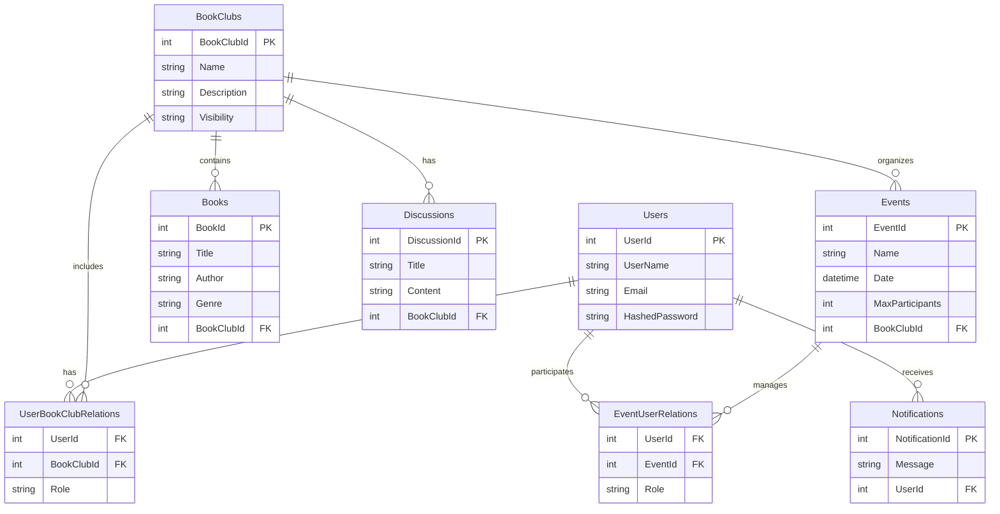
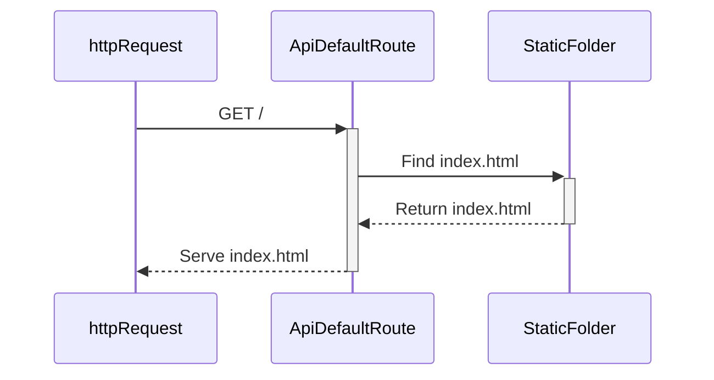
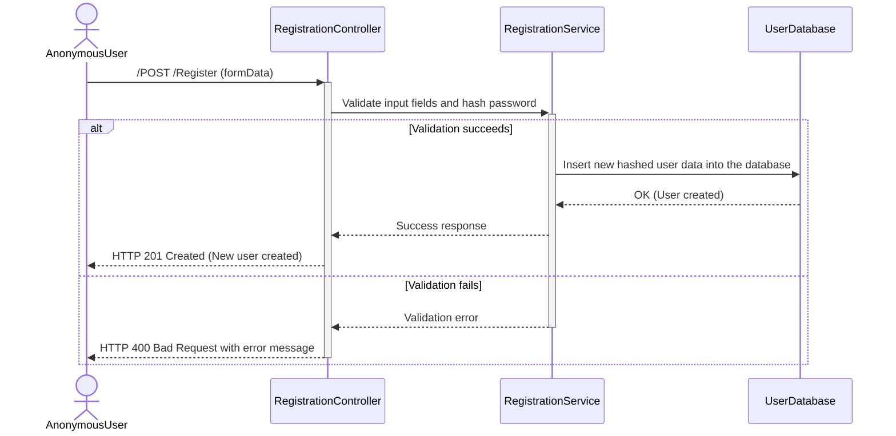

## Entitetsrelasjonsdiagram



## Default Route - Static File Servisi


 **Description:**

- The user sends a GET request to the / route from their browser.
- The API searches for the index.html file in the StaticFolder and, if found, returns it to the browser.

## Register User

 **Description:**

- The user fills out the registration form and submits it.
- The RegistrationController receives the form data and validates it through the RegistrationService.
- If Validation Succeeds:
- User information (with the hashed password) is saved to the UserDatabase.
- Upon successful registration, the user receives a success message (HTTP 201 Created).
- If Validation Fails:
- A validation error is returned for missing or invalid fields (HTTP 400 Bad Request).


## Homepage with Token Validation

```mermaid
sequenceDiagram
    actor User
    participant View(Index)
    participant AuthService
    participant TokenValidator
    participant UserDatabase

    User ->>+ View(Index): "Open Index Page"
    View(Index) ->>+ AuthService: "Check token in cookies"
    AuthService ->>+ TokenValidator: "Validate token"
    TokenValidator ->>+ UserDatabase: "Retrieve user details"
    UserDatabase -->>- TokenValidator: "User details (if token is valid)"
    TokenValidator -->>- AuthService: "Validation result (valid/invalid)"
    alt Token is valid
        AuthService -->> View(Index): "User authenticated"
        View(Index) -->> User: "Show personalized content"
    else Token is invalid or missing
        AuthService -->> View(Index): "User not authenticated"
        View(Index) ->>+ User: "Display login/register options"
    end

 ```

  **Description**

- User Opens the Page:
- The user opens the homepage (Index) in their browser.
- Token Check:
- The AuthService checks if there is a token in the user's browser cookies.
- If a token exists, it is validated through the TokenValidator.
- Token Validation:
- The TokenValidator queries the database to check if the token is valid.
- If the token is valid, user information is returned.
- Outcome and View:
- If the token is valid:
- The user is shown a personalized homepage (e.g., their username and private book clubs).
- If the token is invalid or missing:
- The user is presented with login or registration options.

  ## User Login

   ```mermaid
      sequenceDiagram
        actor User
        participant Frontend
       participant LoginController
       participant LoginService
    participant UserDatabase

    User ->>+ Frontend: Fill Login Form (email, password)
    Frontend ->>+ LoginController: POST /User/Login
    LoginController ->>+ LoginService: Validate Credentials
    LoginService ->>+ UserDatabase: Find User by Email
    UserDatabase -->>- LoginService: User Found (hashed password)
    LoginService -->> LoginController: Compare Password (valid/invalid)
    alt Credentials are valid
        LoginController ->> Frontend: Return JWT Token
        Frontend -->> User: Login Successful
    else Credentials are invalid
        LoginController ->> Frontend: Return Error Message
        Frontend -->> User: Display Invalid Credentials
    end

    ```
    **Description**
   - Form Submission:
   - The user fills in their email and password in the login form and submits it (POST /User/Login).

   - Authentication Process:
   - LoginController:
   - Receives the email and password from the user.

   - LoginService:
   - Searches the database for a user with the provided email.
   - Validates the password by comparing it with the hashed password stored in the database.

   - Successful Login:
   - If the password is correct:
   - The API generates a JWT (JSON Web Token) for the user.
   - The user can now access the platform with authenticated privileges.

   - Failed Login:
   - If the email is not found or the password is incorrect:
   - An error message is returned.
   - The user is informed that their login credentials are invalid.